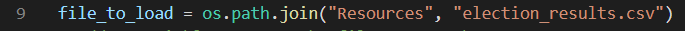
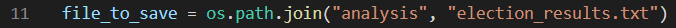

# Election_Analysis

## Overview of Election Audit
A recent local congressional election is having its results audited. In order to do that, they need the following information:

1. Total number of votes cast
2. List of candidates and counties
3. Total number of votes for each candidate and each county
4. Percentage of votes for each candidate and each county
5. The winner of the election based on popular vote
6. The county with the highest turnout

## Election Audit Results
The analysis of the election shows that:
- There were 369,711 votes cast in this election.
- The candidates were:
    - Charles Casper Stockham
    - Diana DeGette
    - Raymon Anthony Doane
- The counties were:
    - Arapahoe
    - Denver
    - Jefferson
- The candidate results were:   
    - Charles Casper Stockham received 85,213 votes, which represents 23% of the total vote count.
    - Diana DeGette received 272,892 votes, which represents 73.8% of the total vote count.
    - Raymon Anthony Doane received 11,606 votes, which represents 3.1% of the total vote count.
- The counties results were: 
    - Arapahoe received 24,801 votes, which represents 6.7% of the total vote count.
    - Denver received 306,055 votes, which represents 82.8% of the total vote count.
    - Jefferson received 38,855 votes, which represents 10.5% of the total vote count.
- The winner of the election based on popular vote was:
    - Diana DeGette (272,892 votes, 73.8% of the vote)
- The county with the highest turnout:
    - Denver (306,055 votes, 82.8% of the vote)

## Election Audit Summary

### Resources
- Data Source: election_results.csv
- Software: Python 3.8.5, Visual Studio Code, 1.52.1
  
### Notes
This analysis uses the election_results.csv as the data source. This CSV file contains a header and 369,711 rows with the Ballot ID, the county and the candidate name. The script opens the CSV file (election_results.csv) and gets the candidate name and the county name from each row. 

A list was created to store the candidate names (candidate_options) and another list was created to store the county names (county_options). The candidate/county name will be added to their respective lists if they are not already there. 

A dictionary was created to store the candidate's name as the key and the votes cast for each candidate as the value (candidate_votes). Another dictionary was created to store the county as the key and the votes cast for each county as the value (county_votes). While going through the CSV file, each row is a vote to be added as the value for its respective dictionary key (candidate's name and county's name). The percentage of votes is calculated using these numbers as well as the total_votes variable that was created to store the total votes count.

The final step is to print the results to the terminal and saving them to a txt file. 

Terminal:

TXT file:

The script that was written on the PyPoll_Challenge.py file can be used again to get the results for other elections. In order to do that, you will need a CSV file with the county and the candidate name for each vote. You can either name it as "election_results.csv" and save it to a folder called "Resources" or you will need to modify line number 9 by replacing election_results.csv with the new CSV file name and Resources with the new folder name.

This script saves the results to a text file called "election_analysis.txt" inside of a folder named "analysis". You can either maintain these names or modify line number 11 as appropriate:

